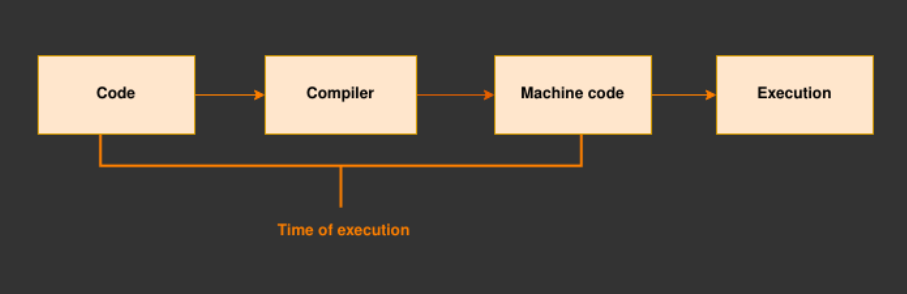
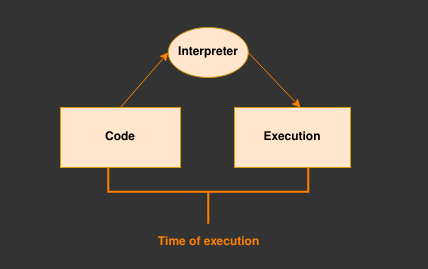

# 🚀 Front-End Foundations  

This repository is dedicated to **organizing essential concepts, summaries, and tips** about front-end development.  

## 📌 About This Repository  
This project serves as a **knowledge hub** where I document key topics, best practices, and insights gained during my daily studies.  

## 📚 Topics Covered  
Throughout my learning journey, I’ll be sharing:  

✅ [Fundamental JavaScript Concepts](#fundamental-javascript-concepts)  
✅ -  

---

## 🔸 Fundamental JavaScript Concepts  
### Interpreted Language vs. Compiled Language

The JavaScript is an interpreted language, but what does that mean?

 - **Compiled Language:** The source code is transformed into machine code before execution. This process helps catch errors early and improves performance.



 Examples: C++, C#, Java...

 - **Interpreted Language:** The source code is executed line by line by an interpreter, without prior compilation. This makes the code more flexible and allows errors to be detected during execution.

 

Examples: JavaScript, Python...

---

### JS Types
JavaScript is a dynamically typed and weakly typed language. Data types are divided into:

- Primitive Types:

   ``` undefined
    null
    boolean
    number
    bigint
    string
    symbol

- Non-Primitive Types:

    ``` Objects
    Arrays
    Functions
    Date

---

### **Scopes**  
The **scope** defines where a variable can be accessed or modified within the code. Scopes in JavaScript can be categorized as follows:

- **Global Scope (e.g., `var`)**:  
  Variables declared in the global scope are accessible from anywhere in the code. For example, when you declare a variable in the global scope, it becomes a property of the `window` object in the browser.  

  **Example**:  
  ```javascript
  var globalVar = "I'm global";
  console.log(window.globalVar); // Outputs: "I'm global"
  ```

- **Function Scope (e.g., `let`, `const`)**:  
  Variables declared within a function are only accessible inside that function. They are not accessible outside the function.  

  **Example**:  
  ```javascript
  function myFunction() {
    let functionVar = "I'm inside a function";
    console.log(functionVar); // Outputs: "I'm inside a function"
  }
  myFunction();
  console.log(functionVar); // Error: functionVar is not defined
  ```

- **Block Scope (e.g., `let`, `const`)**:  
  Variables declared within a block (e.g., inside loops or conditionals) are only accessible within that block.  

  **Example**:  
  ```javascript
  if (true) {
    let blockVar = "I'm inside a block";
    console.log(blockVar); // Outputs: "I'm inside a block"
  }
  console.log(blockVar); // Error: blockVar is not defined
  ```

- **Nested Scope**:  
  A nested scope occurs when a function or block is defined inside another function or block. In this case, inner scopes can access variables from outer scopes, but outer scopes cannot access variables from inner scopes.  

  **Example**:  
  ```javascript
  function outerFunction() {
    let outerVar = "I'm in the outer function";
    
    function innerFunction() {
      let innerVar = "I'm in the inner function";
      console.log(outerVar); // Outputs: "I'm in the outer function"
      console.log(innerVar); // Outputs: "I'm in the inner function"
    }
    
    innerFunction();
    console.log(innerVar); // Error: innerVar is not defined
  }
  outerFunction();
  ```

---

### **Hoisting**  
**Hoisting** is a JavaScript behavior where variable and function declarations are moved to the top of their scope during the compilation phase, before the code is executed. However, **only the declarations** are hoisted, not the initializations. This behavior can lead to some unexpected results if not properly understood.


#### **1. Hoisting with `var`:**  
Variables declared with `var` are hoisted to the top of their scope, but they are initialized with `undefined`. This means that you can reference the variable before its actual declaration, but its value will be `undefined`.

**Example**:  
```javascript
console.log(myVar); // Outputs: undefined
var myVar = "Hello, world!";
console.log(myVar); // Outputs: "Hello, world!"
```
In this case, the declaration of `myVar` is hoisted, but its assignment happens at the line where it is actually declared.


#### **2. Hoisting with `let` and `const`:**  
Variables declared with `let` and `const` are also hoisted, but they are **not initialized**. These variables remain in a "temporal dead zone" from the start of the block until their declaration is encountered. Trying to access them before the declaration results in a **ReferenceError**.

**Example with `let`:**  
```javascript
console.log(myLet); // Error: Cannot access 'myLet' before initialization
let myLet = "I'm hoisted!";
```

**Example with `const`:**  
```javascript
console.log(myConst); // Error: Cannot access 'myConst' before initialization
const myConst = "I'm hoisted!";
```

#### **3. Hoisting with Functions:**  
Function declarations are fully hoisted, meaning that both the declaration and the definition (the body of the function) are moved to the top of the scope. This allows you to call the function before it is defined in the code.

**Example with function declarations:**  
```javascript
myFunction(); // Outputs: "Hello, I am a function!"
function myFunction() {
  console.log("Hello, I am a function!");
}
```

However, **function expressions** (where a function is assigned to a variable) are not hoisted in the same way. Only the variable declaration is hoisted, not the function definition.

**Example with function expressions:**  
```javascript
myFunction(); // Error: myFunction is not a function
var myFunction = function() {
  console.log("I am a function expression!");
};
```
In this case, only the declaration of `myFunction` is hoisted, but since it is initially assigned `undefined`, calling it before the assignment results in an error.

---

### High Order Functions:

A **Higher-Order Function (HOF)** is a function that either takes another function as an argument or returns a function. This concept is fundamental in JavaScript, as it allows functions to be treated as first-class citizens, enabling more flexible and powerful function manipulation. Higher-order functions are key to creating more concise abstractions and using functions in a more functional programming style.  

#### **Examples of Higher-Order Functions**  

1. **`map()`**  
   The `map()` function takes a function as an argument and returns a new array with the results of applying that function to each element of the original array.  

   **Example**:  
   ```javascript
   const numbers = [1, 2, 3, 4];
   const doubled = numbers.map(num => num * 2);
   console.log(doubled); // [2, 4, 6, 8]
   ```

2. **`reduce()`**  
   The `reduce()` function applies an accumulator function to each item in a list, resulting in a single value.  

   **Example**:  
   ```javascript
   const numbers = [1, 2, 3, 4];
   const sum = numbers.reduce((acc, num) => acc + num, 0);
   console.log(sum); // 10
   ```

3. **`filter()`**  
   The `filter()` function takes a function as an argument and returns a new array with only the items that pass the test specified by the provided function.  

   **Example**:  
   ```javascript
   const numbers = [1, 2, 3, 4, 5, 6];
   const evenNumbers = numbers.filter(num => num % 2 === 0);
   console.log(evenNumbers); // [2, 4, 6]
   ```

4. **`forEach()`**  
   The `forEach()` function iterates over the items of an array and executes the provided function on each item. While it does not return a value, it’s useful for performing side effects like logging values or updating variables.  

   **Example**:  
   ```javascript
   const numbers = [1, 2, 3, 4];
   numbers.forEach(num => console.log(num)); // Logs: 1, 2, 3, 4
   ```

5. **`setTimeout()` and `setInterval()`**  
   Both functions take a callback function as an argument and execute it after a specified amount of time. These are higher-order functions that allow scheduling actions in the future.  

   **Example with `setTimeout()`**:  
   ```javascript
   setTimeout(() => {
     console.log("Hello after 2 seconds!");
   }, 2000);
   ```

---
Here’s the explanation about **Closures** in English with examples:

---

### **Closures**  

A **closure** is a function that retains access to its lexical scope (the environment in which it was created) even after that scope has finished executing. This means that a closure "remembers" the variables from its outer function even when it is executed outside of it. Closures are a fundamental concept in JavaScript, often used to create private variables and maintain state across multiple function calls.

#### **How Closures Work:**

When a function is created in JavaScript, it carries with it a reference to its surrounding environment, which is called its "lexical scope". Even if the function is executed outside of that scope, it still has access to the variables and parameters from where it was defined.

#### **Example of a Closure:**

```javascript
function outerFunction() {
  let outerVar = "I am from the outer scope";

  return function innerFunction() {
    console.log(outerVar); // The inner function still has access to outerVar
  };
}

const closureExample = outerFunction();
closureExample(); // Outputs: "I am from the outer scope"
```

In this example, `innerFunction` is a closure because it has access to `outerVar` even after `outerFunction` has finished executing. This is possible because `innerFunction` "remembers" the scope in which it was created.

---
Here’s a brief explanation of **Inheritance** in JavaScript, along with an example:

---

### **Inheritance**  

**Inheritance** is a mechanism in object-oriented programming (OOP) where one object can acquire properties and methods from another. In JavaScript, inheritance is achieved through **prototypal inheritance**, where objects can inherit properties and methods from other objects.

- **Prototype Chain**: Every JavaScript object has a prototype, and it can access properties and methods from that prototype.

#### **Example of Inheritance:**

```javascript
// Parent class
function Animal(name) {
  this.name = name;
}

Animal.prototype.speak = function() {
  console.log(this.name + ' makes a sound');
};

// Child class
function Dog(name, breed) {
  Animal.call(this, name); // Call parent constructor
  this.breed = breed;
}

// Inherit methods from Animal
Dog.prototype = Object.create(Animal.prototype);
Dog.prototype.constructor = Dog;

// Add a method to the Dog class
Dog.prototype.bark = function() {
  console.log(this.name + ' barks');
};

const dog = new Dog('Rex', 'Golden Retriever');
dog.speak(); // "Rex makes a sound" (inherited method)
dog.bark();  // "Rex barks" (own method)
```

In this example, `Dog` inherits from `Animal`, meaning it can access the `speak` method from the `Animal` class, and it also has its own method `bark`.

---

### **DOM (Document Object Model)**  

The **DOM** is an interface that allows JavaScript to interact with the HTML and XML documents. It represents the page so that programs can manipulate the structure, style, and content of a web page dynamically. The DOM treats the document as a tree of nodes, where each node represents a part of the document, such as an element, attribute, or text. Through the DOM, JavaScript can access, modify, add, or delete elements and content on the page.

#### **How the DOM Works:**

- **Document Object**: The `document` object is the entry point for accessing the DOM in a web page.
- **Elements**: HTML elements (like `<div>`, `<p>`, `<h1>`, etc.) are represented as nodes in the DOM tree.
- **Events**: JavaScript can listen for events (like clicks or keypresses) and respond by executing functions.

#### **DOM Structure:**

The DOM is structured as a tree of nodes:
- **Document Node**: The root of the tree, representing the entire document.
- **Element Nodes**: Represent the HTML tags in the document.
- **Text Nodes**: Represent the text inside elements.
- **Attribute Nodes**: Represent the attributes of elements (like `id`, `class`, etc.).

---

#### **Basic DOM Manipulation:**

1. **Accessing Elements**  
   You can use various methods to access elements in the DOM, such as `getElementById`, `getElementsByClassName`, and `querySelector`.

   **Example**:  
   ```javascript
   const myElement = document.getElementById("myElementId");
   console.log(myElement); // Logs the element with id "myElementId"
   ```

2. **Changing Content**  
   Once an element is selected, you can modify its content using the `.innerHTML` or `.textContent` properties.

   **Example**:  
   ```javascript
   const myElement = document.getElementById("myElementId");
   myElement.innerHTML = "New content here!";
   ```

3. **Changing Style**  
   You can change the style of elements dynamically using the `.style` property.

   **Example**:  
   ```javascript
   const myElement = document.getElementById("myElementId");
   myElement.style.backgroundColor = "blue";
   ```

4. **Creating and Appending Elements**  
   JavaScript can create new elements using `document.createElement()` and add them to the DOM using methods like `.appendChild()`.

   **Example**:  
   ```javascript
   const newDiv = document.createElement("div");
   newDiv.innerHTML = "Hello, this is a new div!";
   document.body.appendChild(newDiv); // Appends the new div to the body
   ```

5. **Handling Events**  
   You can attach event listeners to elements to respond to user interactions, like clicks or keypresses.

   **Example**:  
   ```javascript
   const myButton = document.getElementById("myButtonId");
   myButton.addEventListener("click", function() {
     alert("Button clicked!");
   });
   ```

---

## 🚀 Stay Updated  
I continuously update this repository with fresh insights, so feel free to check back often!  

---
